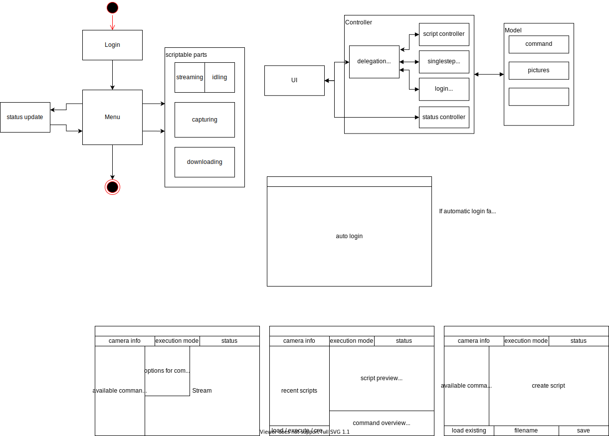

# Controlling the DMC-G81 Camera from Panasonic via PC

This project provides some scripts to control the camera via simple Bash-scripts.  
The scripts only work for the camera-model DMC-G81. 
It is possible that it works for different models too,
though the settings/IPs and some requests are most likely wrong 

---
- ./login  
Register to camera, usually the first step.
Device has to be connected to camera via Wifi

- ./capture  
Capture pictures...
Most settings like ISO can be set here.

- ./getPictures  
Returns a list of captured Photos.
Especially their name is important, which can be used to download the piture

- ./save
Saves a picture, maybe in combination with getPictures for easier usage.

- ./stream  
Open a stream with the liveview of the camera 

---

This is still in progress, so many changes ahead.
Most commands are not complete.  
A rewrite in Python is probably usefull
Network.md has some more information about the commands sent to the camera.

---
This is our first Mockup:

---
TODO:
- change upnp-library
- tests with camera
- event loop
- control
- windows: 
    - registration
    - main window
